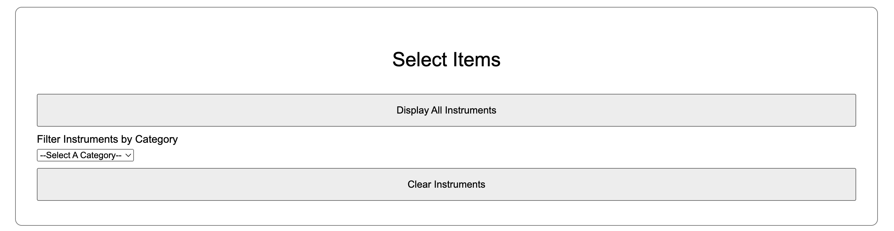
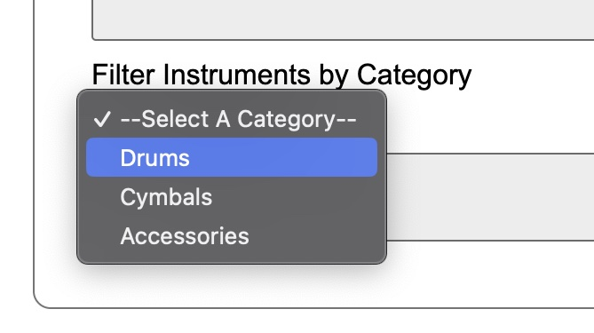
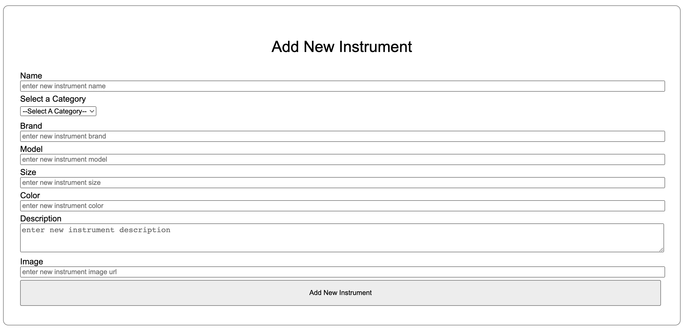
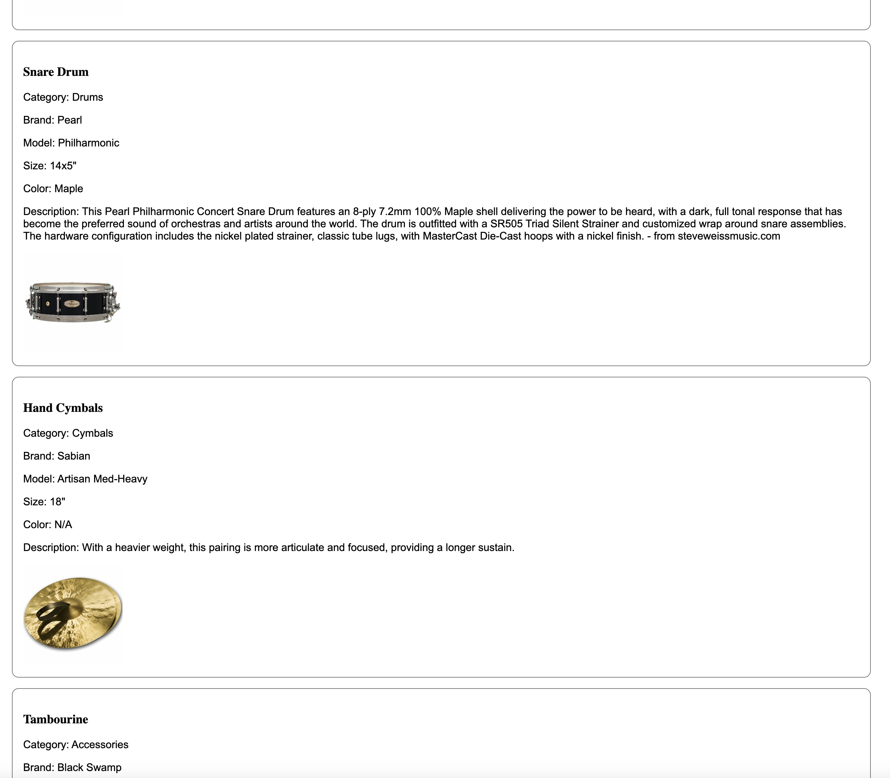

# Cooley's Percussion Inventory :drum:

## Description

This application allows the user to view all percussion instruments in Will Cooley's inventory. The instruments may also be filtered by category (Drums, Cymbals, Accessories). There is a button that clears all the instruments from the page.

There is a form that allows the user to add a new instrument to the inventory. The instrument with all its attributes will be saved to the database and also be viewable on the webpage.

## Visuals

Clicking the Display All Instruments button will display all the items in the inventory on the page.

(Clicking the Clear Instruments button will remove all items from the page)

---

Users may filter the instruments displayed based on their category.

---

Users may create a new instrument that will be displayed on the page and saved in the database.

---

This is an example of what the instrument cards look like.

## Support

If you have any questions, you can find me on Discord: cooleywc

## Acknowledgement

Instrument images and descriptions are from steveweissmusic.com (except for the Black Swamp Snare description).
